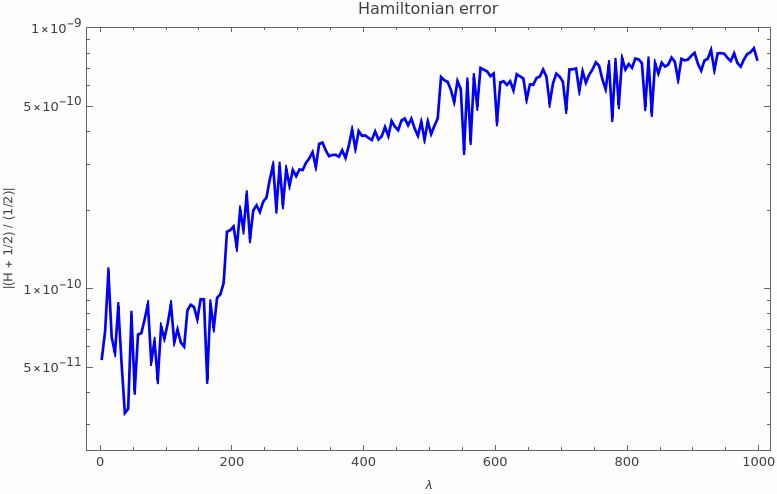

# Kerr-Geodesics

Bound orbits around a Kerr black hole in an external magnetic field, an electromagnetic
analogue of an EMRI. The field breaks integrability at O(`eps^2`), so the Carter constant
becomes `K(lambda)`. The equations integrated are

    (dr/dlambda)^2     = V1(r, theta, K(lambda))
    (dtheta/dlambda)^2 = V2(r, theta, K(lambda))

in Mino time `lambda`, compared against a full 8-dimensional Hamiltonian integration.

Reference: Mukherjee, Kopáček & Lukes-Gerakopoulos,
[arXiv:2206.10302](https://arxiv.org/abs/2206.10302).

## Contents

    mathematica/perturbed-kerr-solver.nb   solver and diagnostics
    mathematica/GRQUICK.m                  metric package
    python/code.ipynb                      earlier first-order solver
    data/                                  reference trajectories and Carter data
    figures/                               output figures

## Parameters

`M = 1`, `a = 0.5`, `E = 0.98`, `Lz = 3.3`, `eps = -0.001`, `r0 = 40.323`, `theta0 = pi/2`.

## Method

`Pr` and `Pth` are integrated as signed variables:

    r' = Pr,      2 Pr Pr'   = dV1/dlambda
    theta' = Pth, 2 Pth Pth' = dV2/dlambda

Turning points are ordinary points: there the terms without a factor of `Pr` cancel, so
`Pr' -> (1/2) dV1/dr`. Fixed-step RK8 at `h = 0.01`, one `NDSolve` call. Adaptive stepping
fails near the first turn.

## Verification

    K(0)                   = 9.5110420912
    V1(40.323, pi/2, K(0)) = 2.6436950215138495
    V1(40.323, 1.4,  K(0)) = 32.157414317596704
    V2(40.323, pi/2, K(0)) = 1.6149420912000014
    V2(40.323, 1.4,  K(0)) = 1.2906783605061847
    dV1/dK = -Delta,  dV2/dK = +1

Use the off-equator values: at `theta = pi/2` the `eps` terms in `V2` vanish.

## Results, lambda = 0 to 1000

- max |r − r_ref| = 1.8e-4, ~31 s
- median |Pr² − V1| = 1.3e-8, median |Pth² − V2| = 7.3e-5
- Hamiltonian: median |(H + 1/2)/(1/2)| = 2.9e-11, max = 8.4e-10

## Running it

Evaluate `mathematica/perturbed-kerr-solver.nb` top to bottom. Data paths are relative to
the notebook (`../data/`). See [`data/README.md`](data/README.md) for file formats.
