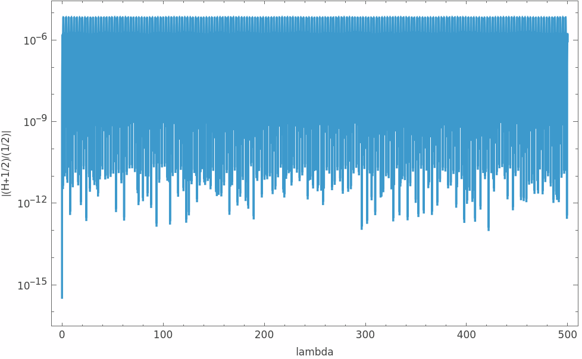

# Kerr-Geodesics

Numerical integration of bound trajectories around a Kerr black hole immersed in an
external magnetic field — an electromagnetic analogue of an extreme mass ratio inspiral
(EMRI).

The magnetic field enters the Hamiltonian through terms `H1` (linear in the perturbation
parameter `eps`) and `H2` (quadratic). `H2` couples `r` and `theta` and so breaks Liouville
integrability. The consequence is that the Carter constant is no longer conserved: it
becomes `K(lambda)`.

**The approximation used here:** hold the geodesic equations of motion fixed in form and
substitute the time-varying Carter constant, giving

    (dr/dlambda)^2     = V1(r, theta, K(lambda))
    (dtheta/dlambda)^2 = V2(r, theta, K(lambda))

with `lambda` the Mino time. Comparing against a full 8-dimensional Hamiltonian integration
is how the range of validity of this reduction is measured.

Reference: Mukherjee, Kopáček & Lukes-Gerakopoulos, *Resonance crossing of a charged body in
a magnetized Kerr background: an analogue of extreme mass ratio inspiral*,
[arXiv:2206.10302](https://arxiv.org/abs/2206.10302).

---

## Contents

    mathematica/perturbed-kerr-solver.nb   second-order solver (main work)
    python/code.ipynb                      first-order solver, Poincare sections
    data/                                  reference trajectories and Carter data
    figures/                               output figures

---

## Parameters

Used throughout, in geometrized units with `M = 1`:

| quantity | value |
|---|---|
| specific energy `E` | 0.98 |
| specific angular momentum `Lz` | 3.3 M |
| Kerr spin `a` | 0.5 M |
| perturbation parameter `eps` | −0.001 |
| initial radius `r0` | 40.323 M |
| initial polar angle `theta0` | pi/2 |
| initial radial direction | outward (`PRi = +1e-3`) |

Radial period `Lambda_r = 2.6703`, polar period `Lambda_th = 1.786`, ratio ≈ 3/2.

---

## Verification constants

These let you confirm an independent implementation is set up identically:

    K(0)                            = 9.5110420912
    V1(40.323, pi/2, K(0))          = 2.643695021
    V2(40.323, pi/2, K(0))          = 1.614942091
    V1(40.323, 1.4,  K(0))          = 32.1574143176
    Sqrt[V1(0)]/r0^2                = 1.0000000114e-3
    Delta(r0)                       = 1545.548329

Two identities hold exactly and are free checks on any implementation of `V1` and `V2`:

    dV1/dK = -Delta
    dV2/dK = +1

**A trap worth knowing:** every `eps`-dependent term in `V2` carries a factor of
`cos^2(theta)`, so at the equator they all vanish and `V2` reduces to `K - (Lz - a*E)^2`
regardless of `eps`. An equatorial check cannot detect a wrong `eps` — that is what the
off-equator value at `theta = 1.4` above is for. If `V1(40.323, ., K(0))` returns
**6853.773**, the `H1` and `H2` terms are missing from `V1` entirely.

---

## Method

The obvious first-order scheme integrates `dr/dlambda = sign * Sqrt[V1]` and recomputes the
velocity algebraically at each step. Moving to a genuine second-order system by
differentiating the constraint introduces a division by `v_r`, which legitimately reaches
zero twice per radial period, and fails at every turning point.

The solver here instead **carries `V1` and `V2` themselves as integrated state variables**
`u1` and `u2`, taking square roots only when a velocity is needed:

    r'     = sr * Sqrt[u1]
    u1'    = sr*Sqrt[u1]*dV1/dr + st*Sqrt[u2]*dV1/dtheta - Delta*Kdot - gam*(u1 - V1)

and similarly for `theta` and `u2`, where `dV2/dK = +1` gives `+Kdot` in place of
`-Delta*Kdot`. There is no division anywhere, and `V1` passing through zero becomes an
ordinary sign change in a smooth variable rather than a singularity. The `-gam*(u1 - V1)`
term damps the integrated state back onto the constraint surface.

Integration is segmented: `NDSolve` runs with fixed direction signs until a `WhenEvent`
stops it at a turning point, and the restart is handled between calls in ordinary
Mathematica code, where `FindRoot` can locate the root of `V1 = 0` to machine precision.
Events fire on `V1`/`V2` evaluated fresh from position, never on the integrated `u1`/`u2`,
which carry truncation error.

---

## Verification

The Hamiltonian is built independently from the metric, with no reference to `V1` or `V2`,
and must equal `-1/2`. Measured over the run:

    median |(H + 1/2)/(1/2)|  = 8.30e-7
    max    |(H + 1/2)/(1/2)|  = 6.83e-6

With `eps = 1e-3`, `eps^2 = 1e-6`. The residual sits at that order, which is what the
construction predicts: the Carter-like constant is obtained by dropping the coupling term
`F = O(eps^2)`, so a Hamiltonian error at second order means the solver is faithful to its
own approximation and the remainder is the known non-integrable piece rather than numerical
error.

---

## A convention that looks like a bug and is not

Two different radial momenta appear in this project, and they differ by
`Sigma/Delta = 1.052` at `r = 40.323`:

- **Poincaré section comparison** uses `U^r = v_r / Sigma`, contravariant. At the section
  `theta = pi/2`, so `Sigma = r^2` and the comparison quantity is `v_r / r^2`.
- **Hamiltonian check** uses the canonical `p_r = v_r / Delta`, which is what appears in
  `g^rr p_r^2`.

Both are correct, for different objects.

---

## Running it

Open `mathematica/perturbed-kerr-solver.nb` and evaluate the cells in order: parameters,
potentials `V1X`/`V2X`, the compiled functions and derivatives, the Carter import, the
reference import, then the integrator. Order matters — the function definitions capture the
potentials at definition time, so changing `eps` requires re-running the assignment cells,
not just the checks.

Data paths are relative to the notebook directory (`../data/`).

---

## Data

See [`data/README.md`](data/README.md) for file formats and provenance.
